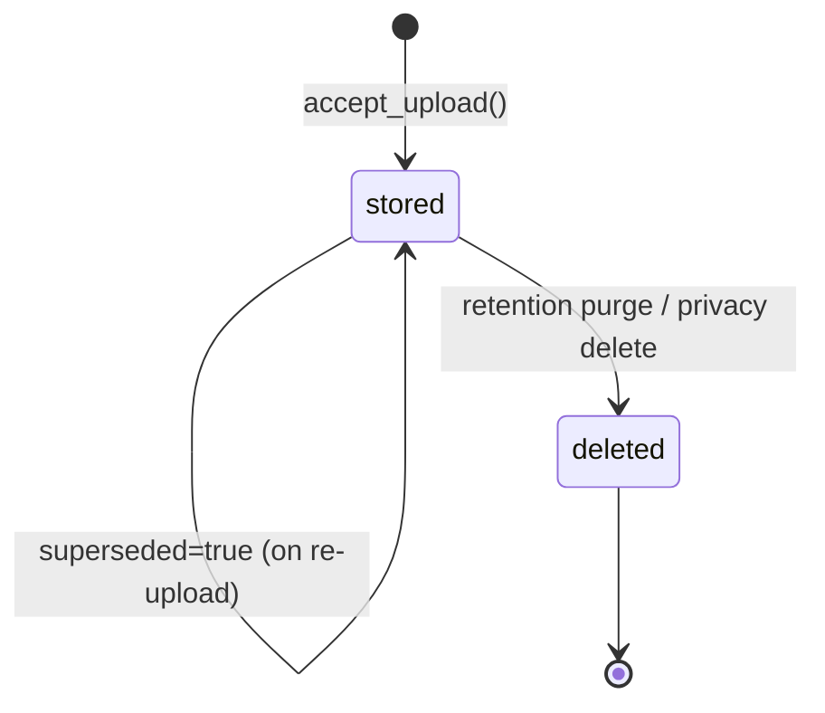
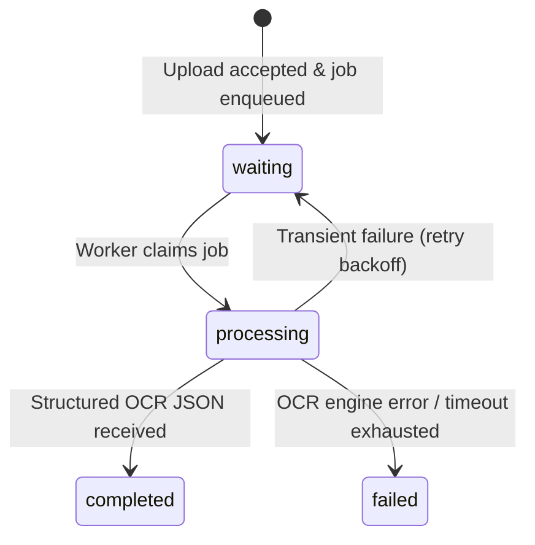
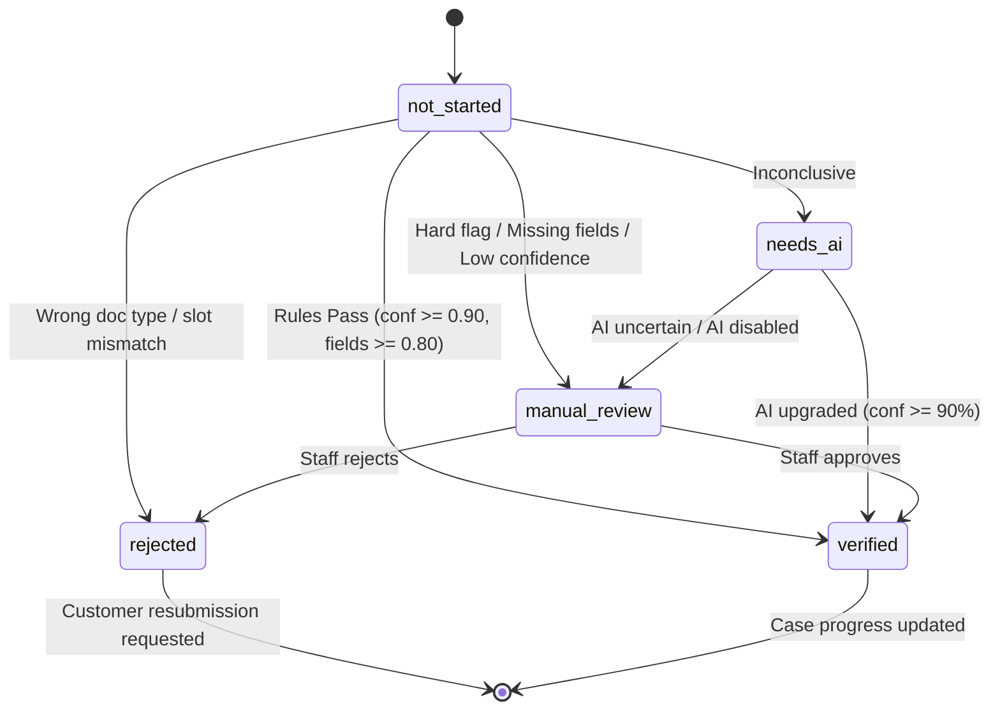
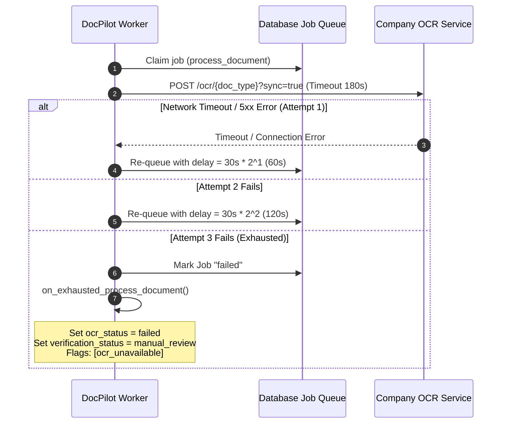
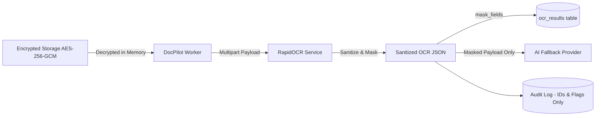
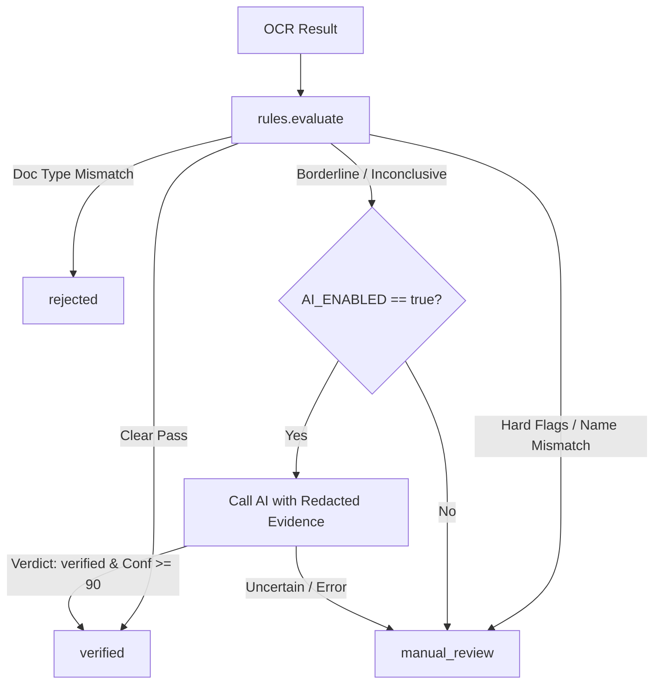

# OCR Integration Contract: DocPilot ↔ Company OCR Service

## Document Overview
This document specifies the exact technical contract, data schemas, security boundaries, status state machines, and operational invariants between **DocPilot** (Workflow Orchestrator) and **Company OCR Service** (RapidOCR Engine & Extraction Microservice).

---

## Architecture Principles & Responsibilities

```mermaid
graph TD
    subgraph DocPilot ["DocPilot (Workflow Orchestration)"]
        Upload[Secure Customer Upload] --> AESEnc[AES-256-GCM Encrypted Storage]
        AESEnc --> JobQueue[Postgres Job Queue / Worker]
        JobQueue --> OCRClient[HTTP OCR Client]
        OCRClient --> RuleEngine[Rules Engine (rules.py)]
        RuleEngine -->|Inconclusive & AI Enabled| AIService[AI Provider (Redacted Evidence)]
        RuleEngine -->|Auto-Verified| CaseRecalc[Case Recalculation]
        RuleEngine -->|Hard Flags / Error| ManualQueue[Manual Review Queue]
        AIService -->|>= 90% Conf| CaseRecalc
        AIService -->|Uncertain| ManualQueue
    end

    subgraph OCRService ["Company OCR Service (Extraction & Verification)"]
        OCRClient -->|POST /ocr/{doc_type}| OCRRoute[OCR Endpoint]
        OCRRoute --> Precheck[Image Quality & Tampering Checks]
        Precheck --> Engine[RapidOCR Offline Engine]
        Engine --> Extractors[Field Extractors (22 Doc Types)]
        Extractors --> Verifier[Checksum, QR & MICR Validation]
        Verifier --> Sanitizer[PII Minimisation & Allowlist]
        Sanitizer --> OCRRoute
    end
```

### Separation of Concerns
1. **DocPilot Responsibility**:
   - Customer authentication, consent ledger, secure upload links, single-use OTPs.
   - AES-256-GCM file encryption at rest in Supabase Storage.
   - Asynchronous worker queue (`FOR UPDATE SKIP LOCKED`) and retry backoff.
   - Deterministic verification rules, name compatibility fuzzy matching, expiry checks.
   - Redacted AI fallback escalation.
   - Staff manual review portal, audit ledger, reminder engine (3/7/14 days), retention purge (7 days).
   - **Invariant**: Never duplicate OCR or computer vision logic inside DocPilot.
2. **Company OCR Service Responsibility**:
   - High-throughput offline OCR using RapidOCR (ONNX runtime).
   - Rule-based regex extraction and tabular parsing across all 22 predefined document types.
   - Document type classification and slot mismatch detection.
   - Mathematical checksum verification (Verhoeff for Aadhaar, Luhn, IFSC/MICR structure).
   - Synchronous extraction or asynchronous job queuing (`/ocr/jobs/{job_id}`) for heavy multi-page documents.
   - Immediate unlinking and secure wiping of temporary processing files.
   - **Invariant**: No workflow state or customer business lifecycle management inside OCR service.

---

## 1. DocPilot → OCR Service Request

### HTTP Endpoint
`POST /ocr/{doc_type}`

- `{doc_type}`: Canonical document slot identifier (e.g. `pan`, `aadhaar`, `gst_certificate`).
- Query Parameter:
  - `sync`: `true` for immediate synchronous execution; `false` or omitted for asynchronous job queueing (recommended for files > 5 pages).

### Request Headers
```http
POST /ocr/pan?sync=true HTTP/1.1
Host: 127.0.0.1:8000
Authorization: Bearer <OCR_API_KEY>
Content-Type: multipart/form-data; boundary=----DocPilotBoundary7MA4YWxkTrZu0gW
User-Agent: DocPilot-Workflow/1.0
```

### Multipart Form Fields
| Field Name | Type | Required | Description |
|---|---|---|---|
| `file` | Binary File | **Yes** | Decrypted document bytes (`.pdf`, `.png`, `.jpg`, `.jpeg`). Max 10MB. |
| `expected` | String (JSON) | Optional | Expected customer metadata for cross-checking, e.g. `{"name": "VIKRAM SHARMA"}`. |
| `customer_id` | String | Optional | DocPilot customer ID for structured audit logging correlation. |
| `webhook_url` | String (URL) | Optional | Destination callback for asynchronous job completion. |

### JSON Schema: Request Parameters
```json
{
  "$schema": "https://json-schema.org/draft/2020-12/schema",
  "title": "DocPilotOCRRequest",
  "type": "object",
  "properties": {
    "doc_type": {
      "type": "string",
      "enum": [
        "aadhaar", "pan", "passport", "voter", "driving_licence",
        "bank_statement", "salary_slip", "cancelled_cheque", "itr", "udyam",
        "shop_establishment", "fssai", "utility_bill", "gst_certificate",
        "certificate_of_incorporation", "partnership_deed", "rent_agreement",
        "form_16", "bank_passbook", "property_tax_receipt", "iec_certificate",
        "income_certificate"
      ]
    },
    "sync": {
      "type": "boolean",
      "default": true
    },
    "expected": {
      "type": "object",
      "properties": {
        "name": { "type": "string" },
        "dob": { "type": "string" },
        "pan": { "type": "string" }
      },
      "additionalProperties": true
    },
    "customer_id": {
      "type": "string"
    }
  },
  "required": ["doc_type"]
}
```

---

## 2. OCR Service → DocPilot Response

### Mode A: Synchronous Response (`200 OK`)
Returned when `?sync=true` is specified or file is processed immediately.

```json
{
  "status": "success",
  "doc_type": "pan",
  "confidence": 0.9625,
  "field_confidences": {
    "pan_number": 0.985,
    "name": 0.940
  },
  "extracted_fields": {
    "pan_number": "ABCPE1234F",
    "name": "VIKRAM SHARMA",
    "father_name": "DUMMY FATHER",
    "dob": "15/08/1985"
  },
  "reason": null,
  "cross_check": {
    "match": true,
    "fields": {
      "name": true
    }
  },
  "qr_disagreements": []
}
```

### Mode B: Asynchronous Handshake (`202 Accepted`)
Returned when `?sync=false` or document is automatically identified as heavy/multi-page.

```json
{
  "job_id": "7f09c636-6c19-48fe-a5f1-320d5718dfbc",
  "status": "pending",
  "doc_type": "bank_statement",
  "created_at": "2026-10-02T09:15:00.123456Z",
  "poll_url": "/ocr/jobs/7f09c636-6c19-48fe-a5f1-320d5718dfbc"
}
```

### Mode C: Async Poll Response (`GET /ocr/jobs/{job_id}`)
- `status`: `"pending"` | `"processing"` | `"completed"` | `"failed"`

```json
{
  "job_id": "7f09c636-6c19-48fe-a5f1-320d5718dfbc",
  "doc_type": "bank_statement",
  "status": "completed",
  "created_at": "2026-10-02T09:15:00.123456Z",
  "updated_at": "2026-10-02T09:15:04.567890Z",
  "result": {
    "status": "success",
    "doc_type": "bank_statement",
    "confidence": 0.9410,
    "field_confidences": {
      "account_number": 0.960,
      "bank_name": 0.922
    },
    "extracted_fields": {
      "account_number": "XXXX9012",
      "bank_name": "State Bank of India",
      "account_holder": "VIKRAM SHARMA"
    },
    "reason": null
  },
  "error": null
}
```

### JSON Schema: OCR Service Response Payload
```json
{
  "$schema": "https://json-schema.org/draft/2020-12/schema",
  "title": "OCRServiceResponse",
  "type": "object",
  "properties": {
    "status": {
      "type": "string",
      "enum": ["success", "low_confidence", "error"]
    },
    "doc_type": { "type": ["string", "null"] },
    "detected_type": { "type": ["string", "null"] },
    "confidence": {
      "type": "number",
      "minimum": 0.0,
      "maximum": 1.0
    },
    "field_confidences": {
      "type": "object",
      "additionalProperties": {
        "type": "number",
        "minimum": 0.0,
        "maximum": 1.0
      }
    },
    "extracted_fields": {
      "type": "object",
      "additionalProperties": true
    },
    "reason": { "type": ["string", "null"] },
    "cross_check": {
      "type": ["object", "null"],
      "properties": {
        "match": { "type": "boolean" },
        "fields": { "type": "object" }
      }
    },
    "qr_disagreements": {
      "type": "array",
      "items": { "type": "object" }
    },
    "message": { "type": ["string", "null"] }
  },
  "required": ["status", "confidence", "field_confidences", "extracted_fields"]
}
```

---

## 3. Document Status States

The lifecycle of uploaded files in DocPilot is tracked across decoupled dimensions:



- `Document.file_state`:
  - `stored`: File is actively encrypted and stored in Supabase Storage (`{customer_id}/{document_id}.enc`).
  - `deleted`: File ciphertext was purged from storage by the retention job (7 days after completion) or customer privacy deletion request.
- `Document.superseded`:
  - `False`: Active document for the slot.
  - `True`: Superseded by a newer upload for the same slot. Kept for historical audit trail but excluded from case completion calculation.
- `Customer.case_status`:
  - `awaiting_consent`: Initial state prior to customer consent.
  - `in_progress`: Consent granted; uploads active or being verified.
  - `completed`: All required slots verified. Triggers 7-day retention deletion countdown (`delete_after`).
  - `expired`: Case expired (30 days without completion). Files purged.
  - `consent_declined` / `consent_withdrawn`: Processing stopped immediately.
  - `deleted`: All customer files purged and records soft-deleted.

---

## 4. OCR Status States

Tracked in `Document.ocr_status` column:



| OCR Status | Meaning | Next Step |
|---|---|---|
| `waiting` | Document uploaded, encrypted, and queued in database job table. | Background worker picks up job using `FOR UPDATE SKIP LOCKED`. |
| `processing` | Worker actively executing HTTP POST or polling async job. | Calls OCR endpoint. |
| `completed` | OCR service returned a valid structured payload (including document type mismatches where text was successfully parsed). | Passes to `rules.evaluate()`. |
| `failed` | Permanent unreadable error or network failure after 3 retry attempts. | Passes to `on_exhausted_process_document()`. |

---

## 5. Verification Status States

Tracked in `Document.verification_status` column:



| Verification Status | Definition | Trigger Condition |
|---|---|---|
| `not_started` | Document uploaded, awaiting worker processing. | Default at upload. |
| `verified` | Document approved and valid for the required slot. | Deterministic rules passed with high confidence, AI upgraded with $\ge 90\%$, or staff manual review approval. |
| `rejected` | Document definitively invalid for the slot. | Detected document type mismatch (e.g. PAN into Aadhaar slot) or staff rejection. |
| `manual_review` | Uncertain or flagged document requiring human inspection. | Name mismatch, missing required fields, low confidence, demo/expired flag, or OCR outage. |

---

## 6. Confidence Values & Thresholds

1. **OCR Microservice Confidence**:
   - `confidence`: Document-level aggregate confidence $[0.0, 1.0]$. Computed as average of sanitized field confidences or text line confidences.
   - `field_confidences`: Individual confidence per extracted key $[0.0, 1.0]$.
2. **DocPilot Governance Thresholds** (from `backend/.env`):
   - `MIN_OVERALL_CONFIDENCE`: **0.90** (Overall score must be $\ge 0.90$ for auto-verification).
   - `MIN_FIELD_CONFIDENCE`: **0.80** (Every required field for the slot must have confidence $\ge 0.80$).
3. **Threshold Enforcement**:
   - If `confidence < 0.90` and no hard flags: routes to `needs_ai` (or `manual_review` if AI disabled).
   - If any required field has confidence `< 0.80`: flag `low_field_confidence:<field>` is attached, automatically forcing `manual_review`.

---

## 7. Error and Failure Format

### HTTP Status Code Handling
| Status Code | Type | Meaning | DocPilot Action |
|---|---|---|---|
| `400 Bad Request` | Permanent | Malformed parameters / bad JSON expected payload. | Logs warning, marks document `manual_review`. |
| `401 / 403` | Operational | Bad API key / invalid bearer token. | Raises `OCRUnavailable`, retries via queue, triggers alert hook. |
| `413 Too Large` | Permanent | File exceeds `MAX_UPLOAD_MB` (10MB). | Rejects document (`file_too_large`). |
| `415 Media Type` | Permanent | Unsupported file extension or corrupted magic bytes. | Rejects document (`unsupported_format`). |
| `429 Rate Limit` | Transient | OCR service concurrency ceiling reached. | Raises `OCRUnavailable`, retries with exponential backoff. |
| `5xx Server Error`| Transient | Internal OCR failure or proxy timeout. | Raises `OCRUnavailable`, retries with exponential backoff. |

### Diagnostic Reason Codes
- `doc_type_mismatch`: Uploaded file does not match expected slot (e.g. uploaded PAN into Aadhaar slot).
- `ocr_engine_returned_no_text`: Document image produced 0 text lines (blank page, corrupted render).
- `ocr_service_unavailable`: Upstream OCR service unreachable or timed out after all attempts.
- `checksum_failed:<field>`: Field failed mathematical checksum validation (Verhoeff for Aadhaar, Luhn, IFSC/MICR).
- `holder_name_mismatch`: Extracted holder name is incompatible with customer account name.
- `document_expired`: Detected expiry date is in the past.
- `demo_or_non_official_document`: Detected synthetic demo document markers.

---

## 8. Timeout and Retry Behavior



- **DocPilot Client Timeouts**:
  - Connect Timeout: **10 seconds**
  - Read/Process Timeout (`OCR_TIMEOUT_SECONDS`): **180 seconds**
- **Job Queue Retries (`app/jobs.py`)**:
  - Maximum Attempts (`OCR_MAX_ATTEMPTS`): **3**
  - Delay Schedule: $30 \times 2^{\text{attempts}}$ seconds (60s, 120s).
- **Graceful Failure Invariant**:
  - A transient OCR outage or network breakdown **never loses a document**.
  - When retries are exhausted, `on_exhausted_process_document()` opens a `ManualReview` ticket so compliance staff can manually inspect the document file.

---

## 9. Idempotency Requirements

1. **Stateless OCR Processing**:
   - The Company OCR Service does not store document state or database references. Submitting the exact same bytes produces identical, deterministic output.
2. **DocPilot Deduplication & Re-execution**:
   - Every uploaded document has an immutable UUID (`Document.id`).
   - Re-running a worker job fetches the exact ciphertext from `storage_key`, decrypts in memory, and submits to OCR with the same parameters.
   - If a customer uploads a replacement file before an existing job completes, `superseded=True` prevents race conditions from overwriting newer document records.

---

## 10. Authentication Between Services

1. **Credential Exchange**:
   - DocPilot authenticates to the OCR service via HTTP Bearer token:
     `Authorization: Bearer <OCR_API_KEY>`
   - The token is a signed Supabase JWT with `role="service_role"` or a pre-shared cryptographic key validated by `security.authenticate_request`.
2. **Zero Secrets in Logs Invariant**:
   - Raw JWTs, API keys, document text, and document bytes are strictly excluded from application logs and audit tables.
   - Only non-sensitive metadata (`user_id`, `customer_id`, `document_id`, `doc_type`, `duration_ms`, `status`) is logged.

---

## 11. PII and Privacy Boundaries



1. **Storage Encryption**:
   - All document files are encrypted with AES-256-GCM (`ENCRYPTION_KEY`) before saving to Supabase Storage.
2. **OCR Service Sanitization**:
   - Raw fields are sanitized strictly after format validation and checksum verification.
   - Aadhaar numbers are masked to the last 4 digits (`XXXX XXXX 1234`).
   - PAN numbers are masked (`ABC****12F`).
   - Bank accounts are masked (`XXXX1234`).
3. **DocPilot Persistence**:
   - DocPilot applies `mask_fields()` before saving into `ocr_results.payload`.
   - Raw plaintext lives only in memory during the execution of `handle_process_document`.
4. **Audit Log Invariant**:
   - Application logs and `audit_log` records never contain PII or unmasked document contents.

---

## 12. AI Escalation Boundary



### Strict AI Invariants
1. **Rules Run First**:
   - Deterministic rule evaluation always runs before AI. Clear passes and clear rejections never call AI.
2. **Redacted Evidence Only**:
   - When AI is invoked (`ai_service.assess()`), it receives **only** PII-masked JSON (`mask_fields()`) and diagnostic flags.
3. **One-Way Upgrade**:
   - AI can only upgrade an inconclusive case to `verified` if its confidence score is $\ge 90\%$.
   - AI can **never** downgrade a verified document, and can **never** verify a document where OCR status is `failed` or `error`.
4. **Failure Safety**:
   - If the AI provider is disabled, times out, or returns uncertain scores, the case safely falls back to `manual_review`.

---

## 13. Manual Review Information

When a document cannot be verified automatically, a record is opened in `manual_reviews`:

```json
{
  "review_id": "71eca98d-a875-470a-8a52-4e356e6eca66",
  "document_id": "5dd6663b-4387-4a4c-b65e-350662f45089",
  "customer_id": 58,
  "status": "open",
  "reason": "Customer name slightly differs from extracted PAN name",
  "flags": [
    "holder_name_mismatch"
  ],
  "created_at": "2026-10-02T09:12:00Z"
}
```

### Staff Portal Actions
- **Secure View Modal**: Staff preview the decrypted document via authenticated blob URLs (`URL.createObjectURL(blob)`), with strict cleanup (`URL.revokeObjectURL(url)`) upon modal close or unmount.
- **Conditional Download**: The "Download" button is rendered **only** when `ALLOW_DOWNLOAD=true` is enabled in backend policy.
- **Decision Resolution**:
  - `Approve`: Updates document to `verified`, recalculates customer case status.
  - `Reject`: Updates document to `rejected`, requests customer resubmission with specific guidance.

---

## 14. Required Document and Result Fields

All 22 canonical document types and their non-negotiable required fields for auto-verification:

| Document Type (`doc_type`) | Display Label | Required Fields for Auto-Verification |
|---|---|---|
| `aadhaar` | Aadhaar Card | `aadhaar_number`, `name` |
| `pan` | PAN Card | `pan_number`, `name` |
| `passport` | Passport | `passport_number`, `name` |
| `voter` | Voter ID | `epic_number`, `name` |
| `driving_licence` | Driving Licence | `licence_number`, `name` |
| `bank_statement` | Bank Statement | `account_number`, `bank_name` |
| `salary_slip` | Salary Slip | `employee_name`, `employer_name` |
| `cancelled_cheque` | Cancelled Cheque | `account_holder`, `ifsc` |
| `itr` | Income Tax Return | `acknowledgement_number`, `name` |
| `udyam` | Udyam MSME Certificate | `udyam_registration_number`, `enterprise_name` |
| `shop_establishment` | Shop & Establishment Certificate | `establishment_name`, `registration_number` |
| `fssai` | FSSAI Food Licence | `fssai_licence_number`, `business_name` |
| `utility_bill` | Utility Bill | `consumer_number`, `bill_amount` |
| `gst_certificate` | GST Certificate | `gstin`, `legal_name` |
| `certificate_of_incorporation` | Certificate of Incorporation | `cin`, `company_name` |
| `partnership_deed` | Partnership Deed | `firm_name` |
| `rent_agreement` | Rent Agreement | `monthly_rent` |
| `form_16` | Form 16 Part A/B | `employer_name`, `pan_number` |
| `bank_passbook` | Bank Passbook | `bank_name`, `ifsc` |
| `property_tax_receipt` | Property Tax Receipt | `property_id`, `tax_amount_paid` |
| `iec_certificate` | Import Export Code (IEC) | `iec_number`, `entity_name` |
| `income_certificate` | Income Certificate | `certificate_number`, `annual_income` |

---

## Contract Verification Checklist
- [x] DocPilot performs orchestration, never duplicated OCR.
- [x] Company OCR Service processes offline OCR and checksums.
- [x] Rules run before AI.
- [x] AI receives strictly redacted evidence.
- [x] Failed OCR can never become VERIFIED.
- [x] No n8n or Redis dependencies (Postgres `SKIP LOCKED` job queue).
- [x] Zero PII or JWT secrets in audit logs.
- [x] AES-256-GCM encryption at rest in Supabase Storage.
- [x] DOM blob URL cleanup (`URL.revokeObjectURL`) to prevent memory leaks.
- [x] Conditional download button gated by `ALLOW_DOWNLOAD=true`.
